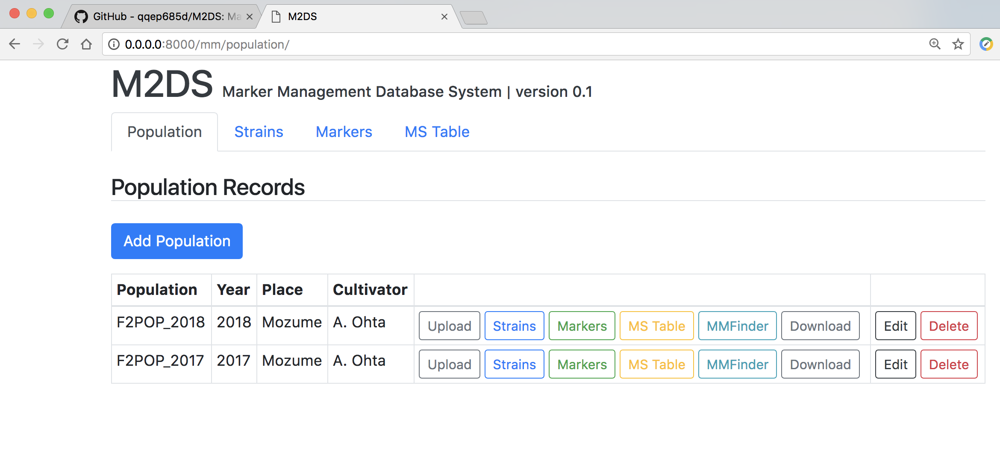

# M2DS: Marker Management Database System
This application is a tool for managing the polymorphic data of markers in F2 or RILs population.

**ATTENTION: This Application is still the version of the development environment. Please use on local server. Regarding the use of this application, note that I am not responsible for any loss, damages and troubles.**

## REQUIREMENTS

### Software
- Docker
    - Mac: Docker for Mac
    - Windows: Docker Toolbox

---

## Getting M2DS

1. Download and Install the Docker software.  

    Download site:  
    [https://www.docker.com/community-edition#/download](https://www.docker.com/community-edition#/download)

1. Start Docker

    If you use MacOS machine, start Terminal.  
    See details: [https://store.docker.com/editions/community/docker-ce-desktop-mac](https://store.docker.com/editions/community/docker-ce-desktop-mac).

    If you use Windows machine, click the Docker QuickStart icon on your desktop, and start Terminal.  
    See details: [https://docs.docker.com/toolbox/toolbox_install_windows/#step-3-verify-your-installation](https://docs.docker.com/toolbox/toolbox_install_windows/#step-3-verify-your-installation)

1. Type command on Terminal (using Git):  
`git clone https://github.com/qqep685d/M2DS.git`  
and  
Move to the directory, M2DS: `cd M2DS`

1. Type command:  
`sh 01_build_app.sh`

1. Type command:  
`sh 02_create_db.sh`

---

## Basic Usage

Start Terminal on `M2DS/`.

1. Type command:  
`sh 03_run_server.sh`

1. Go to the URL on web browser:  
`127.0.0.1:8000`

1. Use application "M2DS"  
    1. Click `Add Population`  
        Input each fields and click `OK`.  
        ("Name" and "Year" are required fields.)  

    1. `Upload` file and `Import` dataset into database  in M2DS.  
        `M2DS/samples/sample_dataset.txt` is an example file.  

    1. View records: `Strains`, `Markers` and `MS Table`.

    1. Edit / Delete records.

    1. `Download` dataset.

1. (Option) You want make M2DS back to the initial state, type command `sh 04_clear_app.sh`.  
__Attention: This command remove some files from M2DS:
database file (db.sqlite3), uploaded and download files.__

---

## Dataset File

See the example files:  
`M2DS/samples/sample_dataset.txt` or `M2DS/samples/sample_dataset_add.txt`

- The first row is header line.  
    - The first column is "MARKER". (Don't change!)
    - The second column is "TYPE". (Don't change!)
    - The third column and later are "strain names". You can input arbitrary names.

- The second row and later are each values.
    - The first column is "marker name". You can input arbitrary names. But the duplicated names is not allowed.
    - The second column is "type of marker". Input `g` or `p`.  
        - `g`: Genotype (Genetic marker)
        - `p`: Phenotype (Trait)
    - The third column and later are "marker values of each strain" for the marker. Input `A`, `B`, `H` or `-`.  
        * Genotype
            - `A`: Homozygous genotype of Parent 1 allele
            - `B`: Homozygous genotype of Parent 2 allele
            - `H`: Heterozygous genotype  
            - `-`: missing genotype
        * Phenotype
            - Strings, Integer or Float etc.
            - `-`: missing value

---

### Softwares and Python packages included in M2DS
#### Softwares
- Python (3.6.3)
- SQLite3 (3.19.3)

#### Python Packages
- Django (2.0.3)
- django-bootstrap4 (0.0.6)
- django-pandas (0.5.1)
- numpy (1.14.2)
- pandas (0.22.0)

---

## License

This software is released under the MIT License, see [LICENSE](./LICENSE).
